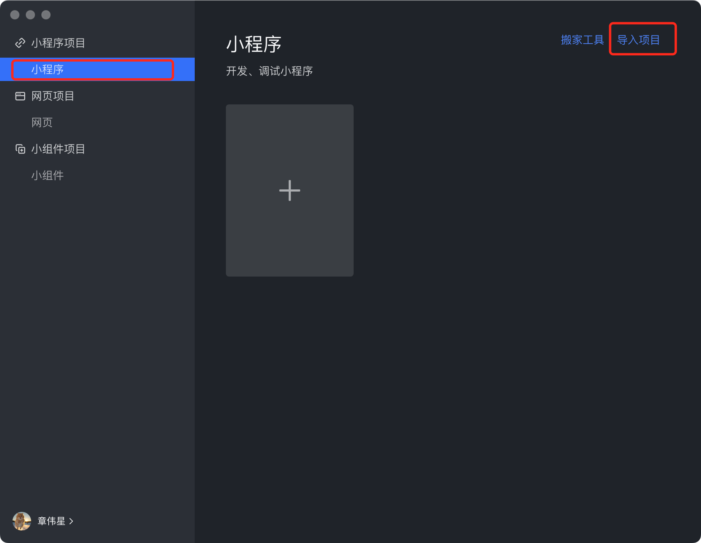
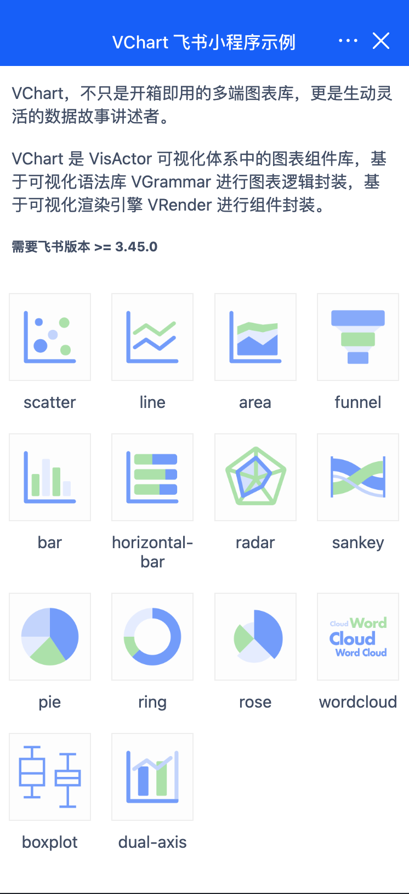

# @visactor/lark-vchart 使用示例

## 如何使用

在使用 VChart 飞书小程序组件库前，请确保你已经了解过飞书开放平台的相关文档介绍。

- [自定义组件](https://open.feishu.cn/document/uYjL24iN/ugTOugTOugTO)
- [npm 支持](https://open.feishu.cn/document/uYjL24iN/uEzMzUjLxMzM14SMzMTN/npm-support)

### Step 1: 下载飞书开发者工具

* 飞书版本 >= 3.45
* [飞书开发者工具](https://open.feishu.cn/document/uYjL24iN/ucDOzYjL3gzM24yN4MjN)


### Step 2：打开飞书开发者工具，导入该项目



### Step 3: 安装依赖

在项目根目录下运行安装命令：

```bash
# npm 
$ npm install

# yarn
$ yarn
```

### Step 4: 开启 npm 能力

开启编辑器 > 详情 > 本地设置 > 使用 npm，具体操作可阅读[开启 npm 能力](https://open.feishu.cn/document/tools-and-resources/development-tools/npm-support#26ae361b)。


### Step 5: 体验

至此你就可以体验该示例了。



## 问题反馈

如果在使用过程中发现问题，欢迎在 [GitHub issues](https://github.com/VisActor/VChart/issues/new/choose) 中向我们反馈，非常感谢！